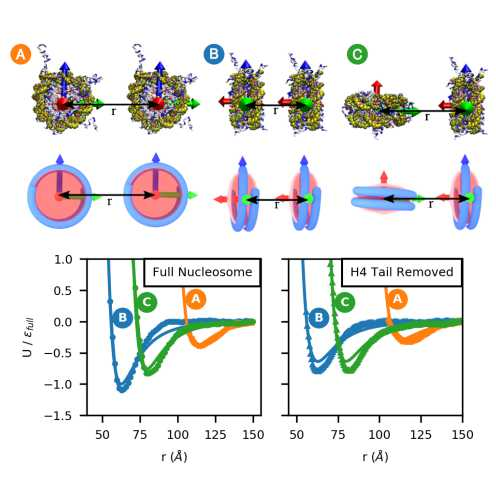

.. _label-correction:

Corrections of the 1CPN Paper
==================================================================

This page is about the corrections made to the 1CPN paper: 

Lequieu, Cordoba, Moller, de Pablo "1CPN: A coarse-grained multi-scale model of chromatin" (2019) `J. Chem. Phys. 150, 215102 <https://doi.org/10.1063/1.5092976>`_

Updates on Fig. 6 of 1CPN Paper
----------------------------------------------------------------------
The original version of Fig. 6 included in the 1CPN paper was inconsistent with the parameters of the Zewdie potential provided in Table S3. The corrected figure is shown here: 

(the points are the pair-potential calculated using the 3SPN-AICG model, and the lines are the Zewdie potential fit. Notice that the y label should be :math:`\varepsilon_{full}` rather than :math:`\varepsilon_{0, full}`)

:math:`\varepsilon_{0, H4cut}` in TABLE. S3 of 1CPN paper
--------------------------------------------------------------------------------
The value of the :math:`\varepsilon_{0, H4cut}` included in the TABLE. S3 was 1.303 kcal/mol, and should be corrected as 1.0081 kcal/mol as in the github repository `${D_1CPN}/inputs/in.var-zewdie-H4`. 

Note that none of these corrections actually affect the results produced by the 1cpn model. 

