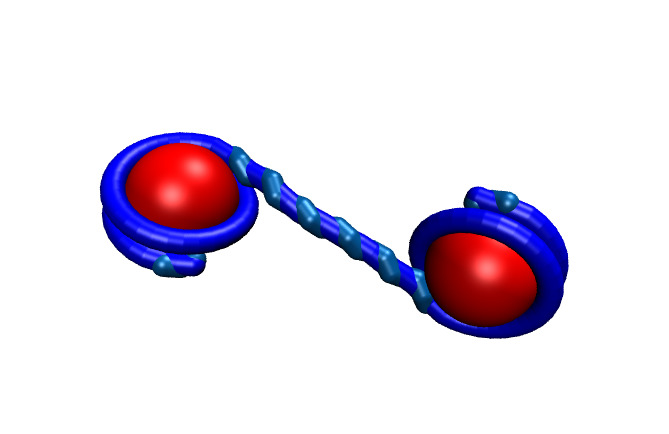
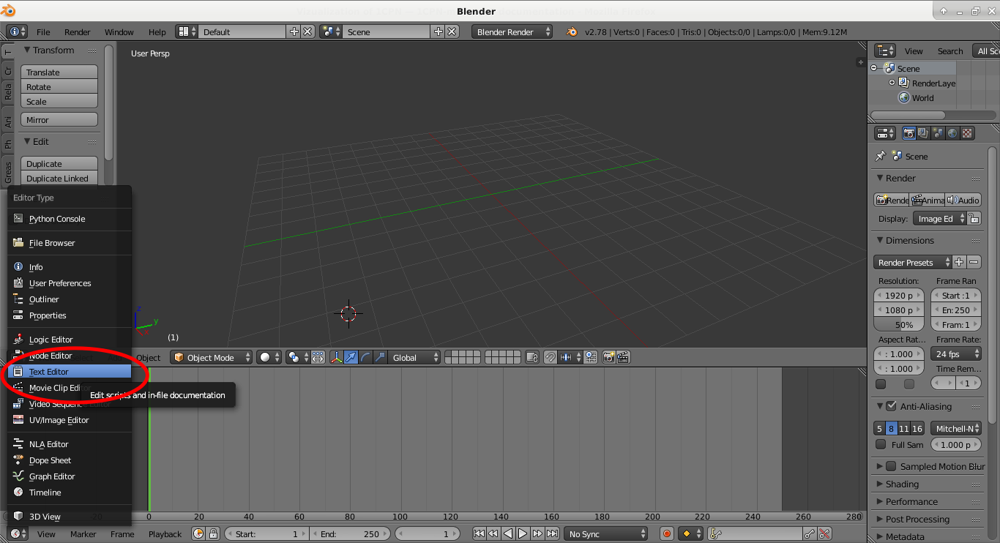
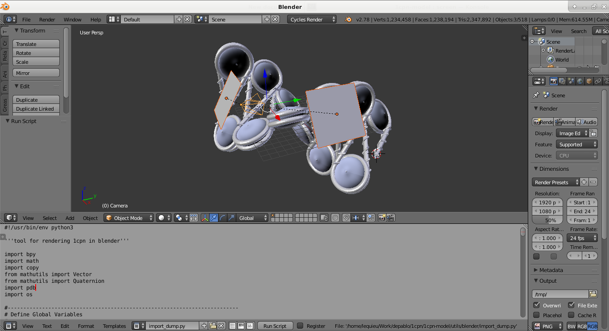
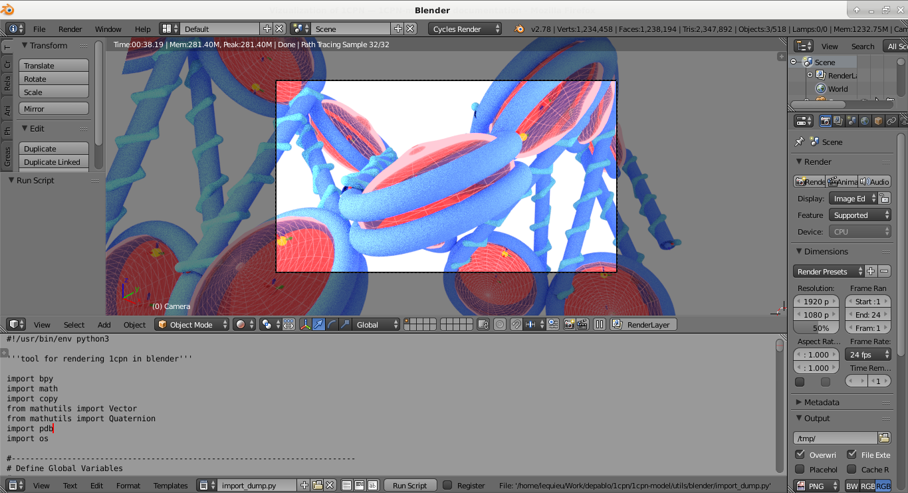

.. _label-viz:

Vizualization of 1CPN
==================

Each site in the 1CPN model is represented by an anisotropic potential, where both the orientation and the position of a site.

Vizualizing the 1CPN model is more chalenging than many other molecular models because each coarse-grained sit in 1CPN in represented by an anisotropic potential. Most vizualization tools (like VMD) are designed for isotropic sites, and generally represent sites in the vizualization by spheres. Therefore because of its anisotropic potentials in 1CPN,  vizualizing the model requires some additional steps.

The 1CPN model includes offers several workflows for vizualizing 1CPN trajectories. 
The ideal workflow depends on the type of simulation you have run, and the phenomena of interest that you want the simulation to highlight. 
For this Quick Start Tutorial, only workflows using `VMD <http://www.ks.uiuc.edu/Research/vmd/>`_ (Visual Molecular Dynamics) are decribed. 
The 1CPN model also contains tools for high quality vizualization using `Blender <https://www.blender.org/>`_ .

Users who do not have VMD should install it following the instructions at the  `VMD website <http://www.ks.uiuc.edu/Research/vmd/>`_ (note that VMD 1.9.2 was used in this tutorial).

Throughout this tutorial it is assumed that VMD is accessed though  `vmd` at the command line.

Option 1: Basic VMD
--------------------------------------
*Speed = Fast, Vizualization Quality=Poor*

The 1CPN can be quickly vizualized by loading `traj.dump` directly into LAMMPS.

::

    vmd in.psf -lammpstrj traj.dump

Now that the trajectory is loaded into LAMMPS, a suitable visual representation can be loaded by  Opening the `Tk console`  by clicking on Extensions->Tk Console, in the `VMD Main` window, and executing the following command.

::

    source <path-to-D_1CPN>/1cpn-model//utils/vmd/1cpn.vmd

Note that in this case the bash variable `${D_1CPN}` cannot be used and `<path-to-D_1CPN>` must be hardcoded manually.
If you will be vizualizing the 1CPN Model frequently, it is recommended that you add this `source` command a file located at `~/.vmdrc` so that it will be executed automatically when VMD opens.

Though this visualization can be useful for some purposes (like examining bond lengths and angles), it is generally unsuitable for visualizing large simulations.

FIXME make 1cpn.vmd look acceptable for vizualizing the raw traj.dump
FIXME SAMPLE VIZUALIZATION

Option 2. Enhanced VMD (recommended)
--------------------------------------
*Speed = Medium-Fast, Vizualization Quality=High*

Another approach for vizualizing the 1CPN model is to convert `traj.dump` into a new file where anisotropic sites are more easily vizualized, and then visualizing this new trajectory file direcly in VMD.

In 1CPN, this conversion tool is an executable `dump-to-xyz` that is located in `${D_1CPN}/bin/` and is compiled by 

::

    cd ${D_1CPN}/1cpn-model/src/viz
    make

FIXME, this breaks if LAMMPS_SRC isn't canonical.
FIXME remove quat_vec_rot from trajectory_iterator.h
FIXME have a single Makefile in ${D_1CPN}

The executable `dump-to-xyz` takes two arguements:

#. The filename of an existing trajectory (`traj.dump` in this example),  and 
#. The filename prefix of the new trajectory files to be generated  (`traj_1cpn` here).

::

    ${D_1CPN}/1cpn-model/bin/dump-to-xyz traj.dump traj_1cpn

After executing this command, two new files (`traj_1cpn.psf` and `traj_1cpn.xyz`) are generated. These files contain a modified topology file (`.psf`) and a modified trajectory file (`.xyz`).
Specifically, these new files contain create additioal (fictitious) sites that show the orientation of each 1CPN site. For Nucleosome sites, these fictitious sites are created to highlight their anisotropic shape (from the Zewdie potential LINKME). For DNA sites, fictitious sites are created to highlight the twist of the DNA molecule.

These new files can be vizualized with VMD 

::

    vmd traj_1cpn.psf traj_1cpn.xyz
    # or
    vmd traj_1cpn.*

An example of a nucleosome rendered using Option 2 is shown here:

Option 3. Blender
-------------------------------
*Speed=Low, Vizualization Quality=Very High*

The final option for vizualizing the 1CPN model is to use the open source 3D conputer graphics toolset `Blender <https://www.blender.org/>`_.
Blender is a very powerful flexible tool for vizualization and premits the customization of virtually any feature of a digital vizualization.
Blender is not strictly designed for molecular vizualizaiton, and therefore 

This tutorial assumes a basic familiarity with Blender

FIXME Is blender okay for many frames

FIXME Clean up front of Blender script so that its easier for a new person

1. Setting up file paths and rendering options.

The main script of interest is `${D_1CPN}/1cpn-model/utils/blender/import_dump.py` and cha

PATH_ZEWDIE = 
PATH_TRAJ = 

::
    cd /tmp
    ln -s ${D_1CPN}/example/in.dump frame.dump
    

2. Open blender, and change the bottom pannel to text editor

3. In the Text Editor window, click the `Open` button, and navigate to `${D_1CPN}/1cpn-model/utils/blender/import_dump.py`. Once the file is loaded, click the `Run Script` button. This could take a minute or two to run.

.. image:: figs/viz_blender-2.png
   :scale: 50 %
   :align: center

4.  Now the 1CPN Model should be loaded into Blender.

5. To see the artistic rendering, move your mouse into the `3D View` panel and press `Shift-Z` to turn on Materials Rendering (or select `Viewport Shading -> Rendered` using your mouse.) Switching to camera view results in the following image. 

Now that 1CPN is loaded into Blender, anything is possible. Change try new materials, add camera animations, go nuts!

.. note::
  If you're going to be adventerous and start making significant modifications to `${D_1CPN}/1cpn-model/utils/blender/import_dump.py`, I would suggest making file edits in your own text editor and not Blender's build-in one. If your choose to use your own text edior, just make sure to reload the updated `import_dump.py` in Blender's text editor before clicking the `Run Script` button. Blender should notice when `import_dump.py` is changed and notify you, but its important to remember that Blender doesn't refresh its internal text editor by default.

